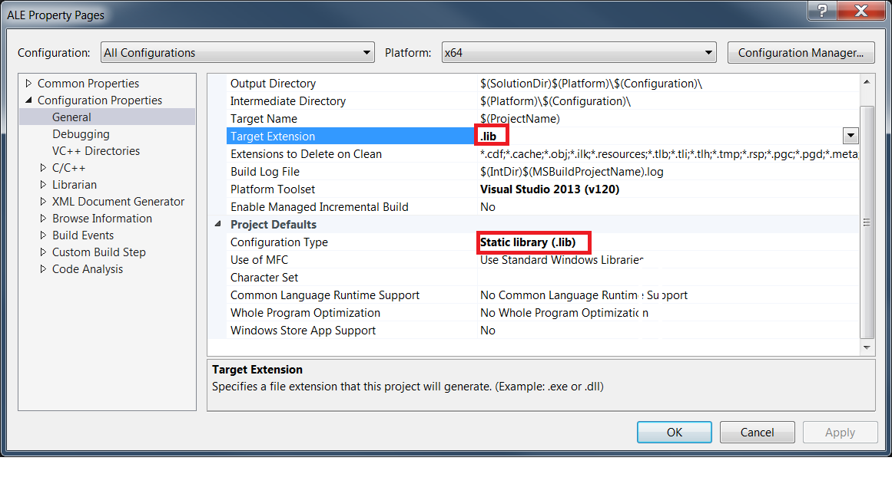

The ALE.sln file contains two VS2013 projects for building the Arcade Learning Environment on Windows.

1. ALE - This project builds the ALE src code and compiles it into a .lib file. It has _USE_SDL defined. It's also possible to switch the compilation to a .exe if needed.

2. ale_python_interface - This takes the .lib produces by the ALE project and compiles the ale_c_wrapper into ale_python_interface.dll needed by the python project.

===============================
Quick start
===============================

If using for the python interface: First build the ALE project, then build the ale_python_interface project. Then you should be able to do python winsetup.py install

If using for another reason you probably want an ALE.exe. Right click the ALE project -> properties -> General: Then change the Target Extension and Configuration Type to .exe. Then rebuild the ALE project.

================
Acknowledgements
================
This couldn't have been done without Martin Brazdil's library https://github.com/MartinBrazdil/The-Arcade-Learning-Environment-0.4.4-Visual-Studio-2013-Windows-8.1-x64
